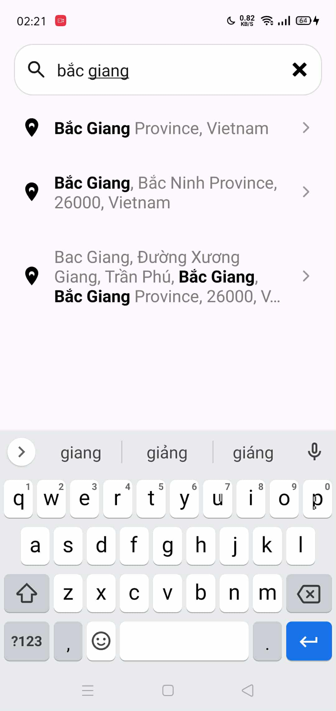
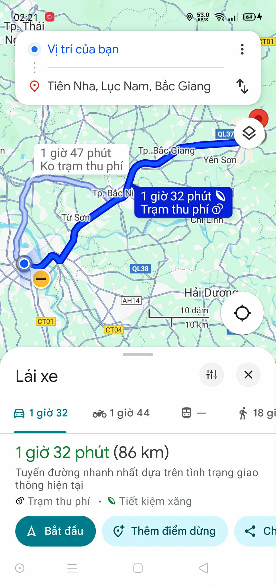

# MOBILE_INTERN_TEST

1. Core Features
* Address Search � Perform search using a location API.
* Display Search Results � Show a list of matching locations.
* Open in Google Maps � Tapping a result opens directions in Google Maps.
* Highlight Search Keywords � Emphasize the matching keywords in the results.
* Debounce Search Input � Apply a 1-second debounce to the search field to avoid excessive API calls.
2. Demo
* Image

* Video

